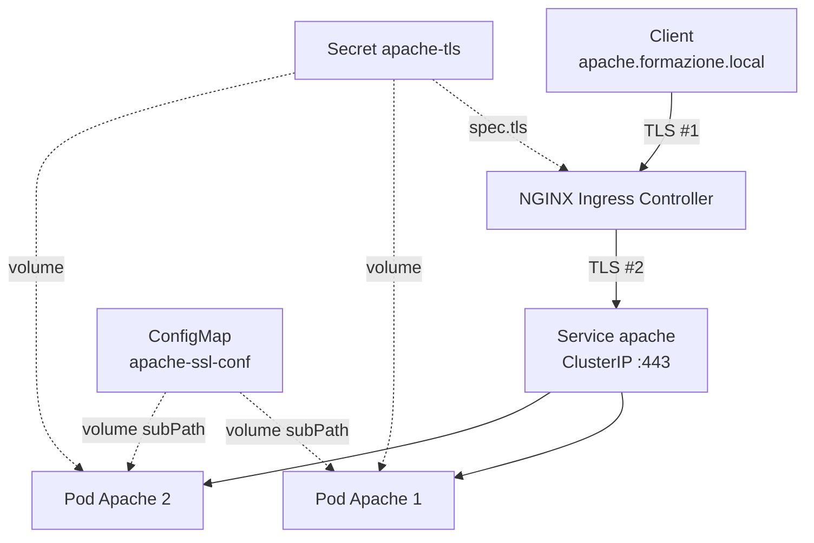

# Deploy di Apache su Kubernetes con Ingress e TLS

Deploy di Apache HTTPS Server su un cluster Kubernetes locale, con:

- due repliche gestite da un **Deployment**;
- configurazione SSL fornita tramite **ConfigMap**;
- certificato TLS autofirmato conservato in un **Secret** e montato nei Pod come volume;
- esposizione interna tramite **Service** di tipo ClusterIP;
- esposizione esterna tramite **NGINX Ingress Controller**;
- routing basato sul nome `apache.formazione.local`
- risoluzione locale del nome tramite `/etc/hosts`.

---

## Architettura



### Le due tratte TLS

La comunicazione TLS avviene su **due connessioni distinte**:

- **Client → Ingress**: NGINX termina il TLS usando il Secret indicato in `spec.tls`.
- **Ingress → Apache**: l'annotazione `backend-protocol: "HTTPS"` fa aprire a NGINX una nuova connessione TLS verso il backend.

Si tratta quindi di **TLS termination con re-encryption**

Entrambe le tratte usano lo stesso certificato.

---

## Ambiente utilizzato

Il laboratorio gira in una VM Ubuntu gestita con Vagrant. Nella VM è presente Minikube con driver Docker.

```
Host → VM Vagrant → Minikube → Cluster Kubernetes
```

---

## Struttura dei file

### Nella repository (versionato)

```
manifests/apache/
├── README.md
├── 01-configmap.yaml
├── 02-deployment.yaml
├── 03-service.yaml
└── 04-ingress.yaml
```

### Sulla VM, fuori dalla repository (non versionato)

```
~/apache-k8s/certs/
├── tls.crt
└── tls.key
```

**I certificati non fanno parte della repository.** La chiave privata non deve mai entrare in un commit: la storia di Git è permanente, e un `git rm` successivo non la rimuove dai commit precedenti — la chiave andrebbe considerata compromessa.

### Ruolo di ciascun elemento

| File / risorsa | Funzione |
|---|---|
| `certs/tls.crt` | certificato pubblico autofirmato per `apache.formazione.local` |
| `certs/tls.key` | chiave privata del certificato — **non versionata** |
| Secret `apache-tls` | conserva certificato e chiave, li rende montabili nei Pod e utilizzabili dall'Ingress |
| `configmap.yaml` | fornisce ad Apache il file di configurazione SSL |
| `deployment.yaml` | mantiene due Pod Apache, abilita `mod_ssl`, monta ConfigMap e Secret |
| `service.yaml` | endpoint stabile interno davanti ai Pod |
| `ingress.yaml` | espone il Service su hostname, con terminazione TLS |

---

## 1. Abilitazione dell'Ingress Controller

Un oggetto `Ingress` contiene solo regole dichiarative: non è un programma. Perché abbiano effetto serve un **controller** reale — un Pod NGINX che osserva l'API server, traduce le regole in configurazione NGINX e ricarica.

Minikube lo fornisce come addon:

```bash
minikube addons enable ingress
kubectl get pods -n ingress-nginx
kubectl get ingressclass
```

L'IngressClass usata dal progetto è `nginx`.

---

## 2. Generazione del certificato TLS

```bash
openssl req -x509 -nodes \
  -newkey rsa:2048 \
  -keyout tls.key \
  -out tls.crt \
  -days 365 \
  -subj "/C=IT/O=formazione-sou/CN=apache.formazione.local" \
  -addext "subjectAltName=DNS:apache.formazione.local"
```

| Opzione | Significato |
|---|---|
| `-x509` | emette direttamente un certificato autofirmato invece di una CSR |
| `-nodes` | non protegge la chiave con passphrase: altrimenti Apache resterebbe bloccato a chiederla all'avvio |
| `-newkey rsa:2048` | genera contestualmente una nuova chiave RSA |
| `-days 365` | validità |
| `-subj` | Subject in formato DN, per evitare il prompt interattivo |
| `-addext` | aggiunge l'estensione SAN |

Il **SAN (Subject Alternative Name)** è necessario affinché i client moderni possano verificare che il certificato appartenga a `apache.formazione.local`. Il campo `CN` da solo non è più sufficiente: dal 2017 circa browser e librerie TLS validano l'hostname esclusivamente contro il SAN.

---

## 3. Creazione del Secret TLS

```bash
kubectl create secret tls apache-tls \
  --cert=tls.crt \
  --key=tls.key \
  --namespace formazione-sou
```

`kubectl create secret tls` produce un Secret di tipo **`kubernetes.io/tls`**, con due chiavi:

```
tls.crt
tls.key
```

> I dati di un Secret sono **codificati in Base64, non cifrati**: chiunque abbia permessi di lettura sui Secret del namespace ottiene la chiave privata in chiaro.
---

## 4. ConfigMap SSL

`configmap.yaml` contiene il file `httpd-ssl.conf` usato da Apache. Le direttive principali:

```apache
Listen 443
SSLEngine on
SSLCertificateFile    "/usr/local/apache2/conf/tls/tls.crt"
SSLCertificateKeyFile "/usr/local/apache2/conf/tls/tls.key"
```

La ConfigMap:

- abilita l'ascolto sulla porta 443, che Apache di default non apre;
- disabilita i protocolli obsoleti (`SSLProtocol all -SSLv3 -TLSv1 -TLSv1.1`);
- configura cipher suite e cache delle sessioni TLS;
- definisce il VirtualHost per `apache.formazione.local`;
- invia i log su stdout/stderr, rendendoli leggibili con `kubectl logs`.

---

## 5. Deployment Apache

`deployment.yaml` crea due repliche dell'immagine `httpd:2.4`.

Il Deployment:

- assegna ai Pod la label `app: apache`;
- abilita `mod_ssl` e `mod_socache_shmcb` tramite `sed` prima dell'avvio;
- include il file SSL fornito dalla ConfigMap;
- espone le porte nominate `http` e `https`;
- monta il Secret in `/usr/local/apache2/conf/tls`;
- monta `httpd-ssl.conf` tramite `subPath`;
- verifica lo stato di Apache con readiness e liveness probe in HTTPS.


### Probe

| Probe | Domanda a cui risponde | Effetto in caso di fallimento |
|---|---|---|
| Readiness | "posso mandarti traffico?" | il Pod esce dagli endpoint del Service, ma resta vivo |
| Liveness | "sei ancora sano?" | il container viene riavviato |

---

## 6. Service

`service.yaml` crea un Service di tipo ClusterIP davanti ai Pod.

Il Service seleziona i Pod attraverso:

```yaml
selector:
  app: apache
```

ed espone:

```
Service:80  → Pod:http  → containerPort 80
Service:443 → Pod:https → containerPort 443
```

Il Service è interno al cluster perché l'esposizione esterna è responsabilità dell'Ingress.

---

## 7. Ingress

`ingress.yaml` espone il Service attraverso il nome `apache.formazione.local`.

Protocollo verso il backend:

```yaml
nginx.ingress.kubernetes.io/backend-protocol: "HTTPS"
```

Di default NGINX contatta il backend in HTTP. Poiché Apache ascolta in TLS sulla 443, senza questa annotazione si otterrebbe un **502 Bad Gateway**.

Il backend è il **Service**:

```yaml
backend:
  service:
    name: apache
    port:
      name: https
```
---

## 8. Test finali

Test HTTPS senza validazione del certificato:

```bash
curl -kv https://apache.formazione.local/
```

Test **con** validazione esplicita, usando il certificato come CA:

```bash
curl --cacert ~/apache-k8s/certs/tls.crt \
  https://apache.formazione.local/
```
